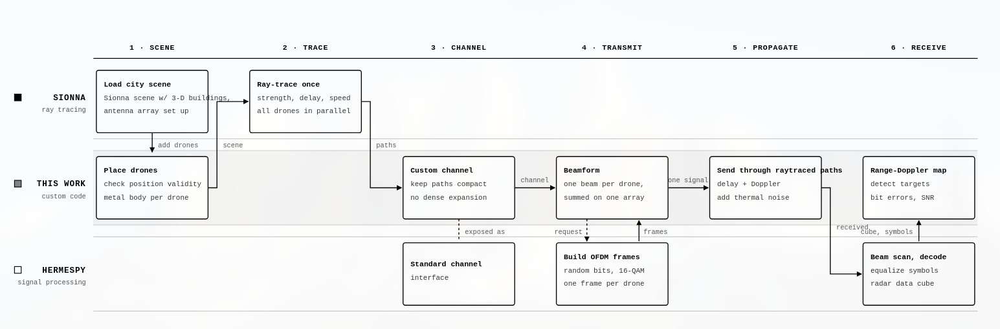

# JCAS Drone Simulation

Joint communication and sensing (JCAS/ISAC) simulation for UAV swarms: one Sionna RT
ray-trace solve per drop feeds both the OFDM radar receiver (monostatic, or one
transmitter with receive-only sensing nodes) and every served drone's comms link, so the
radar illumination *is* the downlink. Waveform, modem and radar processing come from
HermesPy; propagation comes from Sionna RT through a custom parametric channel model.



## Requirements

**Python 3.11+** (developed and tested on 3.11.15; `.python-version` pins 3.11).

HermesPy 1.6, NumPy 2.4, SciPy 1.17 and pandas 3.0 require 3.11 or newer. Every compiled
dependency also ships 3.12 and 3.13 wheels, but those versions are untested.

| Package | Version | Used for |
| --- | --- | --- |
| `sionna-rt` | 2.0.1 | ray tracing, scene/path API (`sionna.rt`) |
| `mitsuba` | 3.8.0 | scene geometry, drone meshes |
| `drjit` | 1.3.1 | Mitsuba JIT backend |
| `hermespy` | 1.6.0 | OFDM modem, beamforming, radar (`OFDMRadar`, `FMCW`) |
| `tensorflow` | 2.21.0 | tensors in `sim.build_rx_path()` and the notebooks |
| `tensorflow-probability` | 0.25.0 | non-integer path subdivisions in `sim.build_rx_path()` |
| `tf_keras` | 2.21.0 | required by `tensorflow-probability` under Keras 3 |
| `keras` | 3.14.1 | TensorFlow dependency |
| `numpy` | 2.4.6 | array math throughout |
| `scipy` | 1.17.1 | detection/estimation helpers |
| `pandas` | 3.0.5 | Monte-Carlo KPI tables |
| `matplotlib` | 3.10.9 | all plots |
| `typing_extensions` | 4.15.0 | `@override` in `geometric_sionna_channel.py` |
| `jupyterlab` | 4.5.7 | running the notebooks |
| `ipykernel` | 7.2.0 | notebook kernel |

## Install

```bash
python3.11 -m venv venv
source venv/bin/activate        # Windows: venv\Scripts\activate
pip install --upgrade pip

pip install "sionna-rt==2.0.1" "mitsuba==3.8.0" "drjit==1.3.1" \
            "hermespy==1.6.0" "tensorflow==2.21.0" "tensorflow-probability==0.25.0" \
            "tf_keras==2.21.0" "keras==3.14.1" "numpy==2.4.6" "scipy==1.17.1" \
            "pandas==3.0.5" "matplotlib==3.10.9" "typing_extensions==4.15.0" \
            "jupyterlab==4.5.7" "ipykernel==7.2.0"
```

Install `sionna-rt`, not the full `sionna` package: the code only uses `sionna.rt`, and
`sionna==2.0.1` pins `h5py>=3.15.1` against TensorFlow 2.21's `h5py<3.15.0`, so pip
cannot resolve the two together. It would also pull in PyTorch for `sionna.phy`.

`tensorflow-probability` is optional: only the non-integer-subdivision branch of
`build_rx_path()` needs it, and its absence raises with an install hint instead of
breaking the import. Without `tf_keras` it fails to import and is reported as missing.

Without an NVIDIA GPU, Mitsuba runs on Dr.Jit's CPU backend, which needs LLVM installed
on the system (e.g. `apt install llvm`, `brew install llvm`). Plain `tensorflow` is
CPU-only on Linux, which is all this project needs; a GPU build reserves several GB of GPU
memory the ray tracer could otherwise use.

## Layout

| File | Contents |
| --- | --- |
| [ofdm_config.py](ofdm_config.py) | OFDM numerology shared by comms and radar; 3.5 / 10 / 28 GHz band presets |
| [sim.py](sim.py) | scene setup, drone meshes, receiver flight paths |
| [geometric_sionna_channel.py](geometric_sionna_channel.py) | parametric Sionna-RT MIMO channel for HermesPy (memory-independent of antenna count²) |
| [jcas_drop.py](jcas_drop.py) | one unified JCAS drop: multi-user precoded downlink + monostatic or multistatic radar, one solve per sensing receiver |
| [sensing.py](sensing.py) | radar snapshots, detection and range/Doppler/azimuth estimation |
| [metrics.py](metrics.py) | CSI estimation, RZF precoding, link KPIs |
| [monte_carlo.py](monte_carlo.py) | seeded random static drone layouts; sweeps range, density, band, comb spacing, P_fa |
| [1_drone.ipynb](1_drone.ipynb), [3_drone.ipynb](3_drone.ipynb) | hand-placed drone flown along a street corridor, timestep by timestep (qualitative check) |
| [2_montecarlo.ipynb](2_montecarlo.ipynb) | runs the Monte-Carlo sweep, writes `monte_carlo_kpis.csv` |
| [4_plots.ipynb](4_plots.ipynb) | plot book over the KPI table, writes `plots/` |
| [5_multistatic.ipynb](5_multistatic.ipynb) | one transmitter and three receive-only sensing nodes, same street corridor |

## License

GNU General Public License v3.0 — see [LICENSE](LICENSE).
